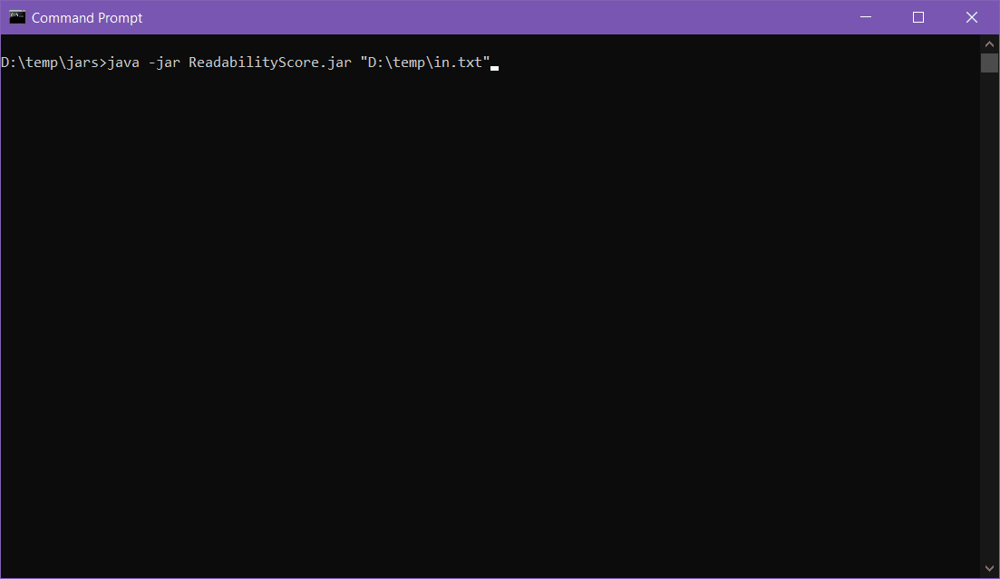

# Readability score.

Developing a program that can identify the difficulty of a piece of text and identify the suitable reading age.

+ The system is implemented in Java. 
+ My implementation of [Hyperskill.org](https://hyperskill.org/projects/39)

Created 2.04.2021

Description of the methods used to calculate readability index text(links to wikipedia):
+ [Automated_readability_index](https://en.wikipedia.org/wiki/Automated_readability_index)
+ [Flesch-Kincaid Grade Level](https://en.wikipedia.org/wiki/Flesch%E2%80%93Kincaid_readability_tests)
+ [Simple Measure of Gobbledygook (SMOG)](https://en.wikipedia.org/wiki/SMOG)
+ [Coleman-Liau index](https://en.wikipedia.org/wiki/Coleman%E2%80%93Liau_index)

